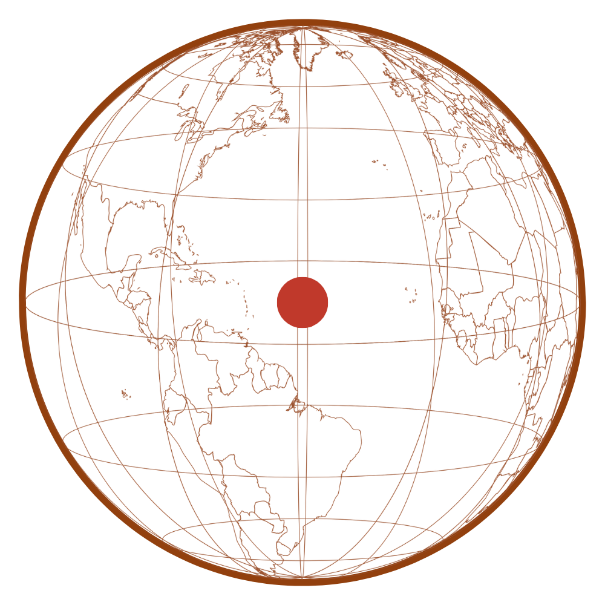

**Northflow Technologies** · [northflow.no](https://northflow.no)
*Institutional scientific discovery infrastructure for climate, space, and critical systems*

---

# CERES Dashboard — Probabilistic Famine Early Warning

**The public-facing dashboard for CERES famine early warning forecasts.**

A Next.js application that visualises weekly probabilistic famine risk predictions across 43 high-risk countries — live maps, regional breakdowns, sub-national intelligence, and a public verification ledger.

[](https://ceres.northflow.no)
[](https://arxiv.org/abs/2603.09425)
[](https://data.humdata.org/dataset/global-ceres-famine-risk-predictions)
[](LICENSE)

---

## Live System

**Dashboard:** [ceres.northflow.no](https://ceres.northflow.no)
**API:** [ceres-core-production.up.railway.app](https://ceres-core-production.up.railway.app)
**HDX Dataset:** [data.humdata.org/dataset/global-ceres-famine-risk-predictions](https://data.humdata.org/dataset/global-ceres-famine-risk-predictions)

---

## Pages

| Page | URL | Description |
|------|-----|-------------|
| Dashboard | `/` | Live tier distribution, global map, hypothesis analysis |
| Regions | `/regions` | All 43 monitored countries with probability scores |
| Region Detail | `/regions/{iso3}` | Full hypothesis chain, driver breakdown, Admin1/Admin2 |
| Map | `/map` | Global choropleth risk map with Admin1/Admin2 layers |
| Sub-national | `/subnational` | Admin1 stress breakdown across monitored countries |
| Validation | `/validation` | Public prediction ledger — pending, awaiting, graded |
| Methodology | `/methodology` | Full technical documentation |
| Data Sources | `/data` | Six data streams, pipeline integration, open downloads |
| API Access | `/api-access` | Tier access, pricing, endpoint documentation |
| About | `/about` | System overview, HGE platform context |

---

## Quickstart

```bash
git clone https://github.com/northflowlabs/ceres
cd ceres
npm install
npm run dev
```

The dashboard connects to the production API at `ceres-core-production.up.railway.app` by default. To point at a local backend:

```bash
NEXT_PUBLIC_API_URL=http://localhost:8000 npm run dev
```

---

## Stack

- **Framework:** Next.js 15 (App Router)
- **Styling:** Tailwind CSS
- **Maps:** Leaflet / React-Leaflet
- **Charts:** Recharts
- **Deployment:** Vercel
- **API:** CERES Core ([northflowlabs/ceres-core](https://github.com/northflowlabs/ceres-core))

---

## Architecture

```
src/
├── app/
│   ├── page.tsx              # Dashboard (live predictions)
│   ├── regions/
│   │   ├── page.tsx          # All regions
│   │   └── [id]/page.tsx     # Region detail
│   ├── map/page.tsx          # Global risk map
│   ├── subnational/page.tsx  # Sub-national breakdown
│   ├── validation/page.tsx   # Public verification ledger
│   ├── methodology/page.tsx  # Technical documentation
│   ├── data/page.tsx         # Data sources
│   ├── api-access/page.tsx   # API documentation
│   └── about/page.tsx        # System overview
├── lib/
│   └── api.ts                # CERES API client
├── components/               # Shared UI components
└── public/
    ├── sitemap.xml
    └── robots.txt
```

---

## Validation Ledger

The validation page displays the complete public record of CERES predictions:

**Pending** — predictions waiting for their T+90 grading window
**Awaiting Data** — grading window open, IPC/FEWS NET data not yet available
**Graded** — predictions graded against published IPC outcomes

Metrics displayed when graded predictions accumulate:
- Brier Score decomposed into reliability, resolution, uncertainty
- Brier Skill Score (BSS) vs climatology baseline
- Sensitivity interval coverage
- Calibration reliability diagram

First grading window: **7 June 2026** (March 9 predictions + 90 days).

---

## Citation

```bibtex
@article{pedersen2026ceres,
  title={CERES: A Probabilistic Early Warning System for Acute Food Insecurity},
  author={Pedersen, Tom Danny S.},
  journal={arXiv preprint arXiv:2603.09425},
  year={2026}
}
```

---

## Related

- **Backend:** [northflowlabs/ceres-core](https://github.com/northflowlabs/ceres-core) — pipeline, API, grading architecture
- **Methodology:** [arXiv:2603.09425](https://arxiv.org/abs/2603.09425)
- **Open Data:** [OCHA HDX](https://data.humdata.org/dataset/global-ceres-famine-risk-predictions)

---

## Licence

CC BY 4.0 — see [LICENSE](LICENSE) for details.

---

*Built by [Northflow Technologies](https://northflow.no) — open-source AI-native infrastructure for humanitarian forecasting, climate, space, and critical systems.*
*CERES is HGE Adapter #5. Live since 28 February 2026.*
